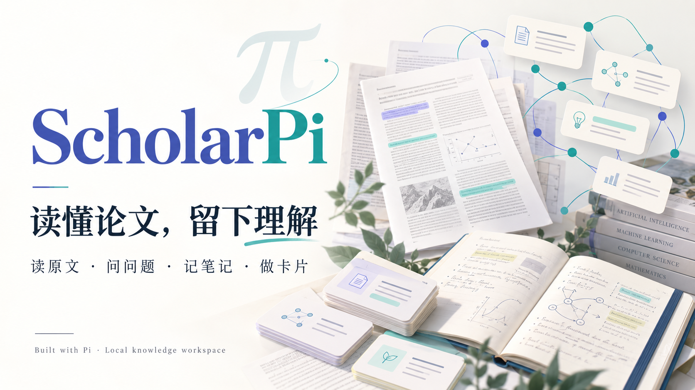
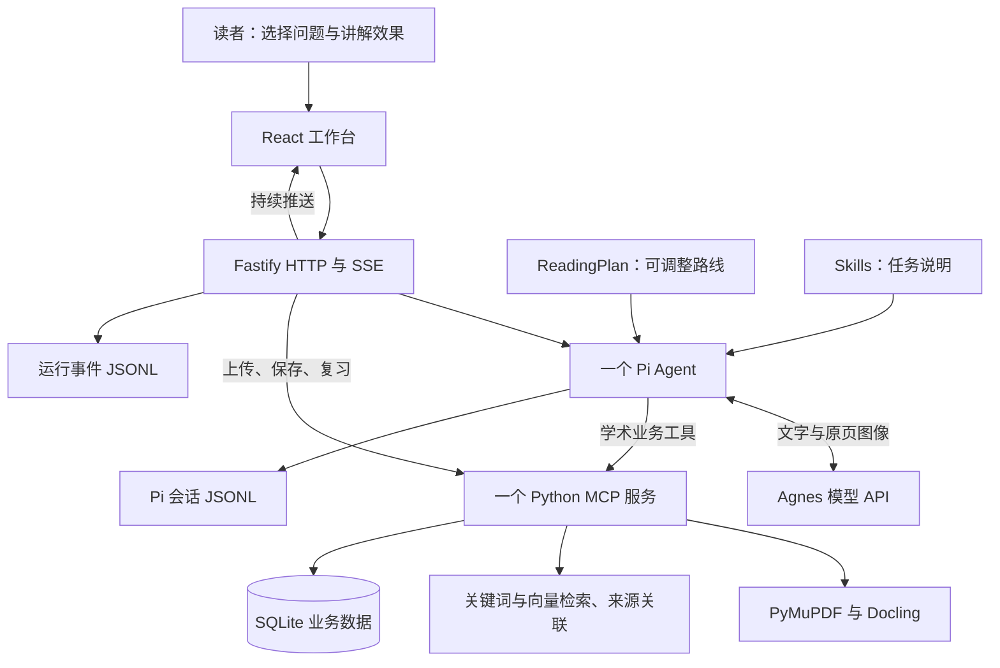
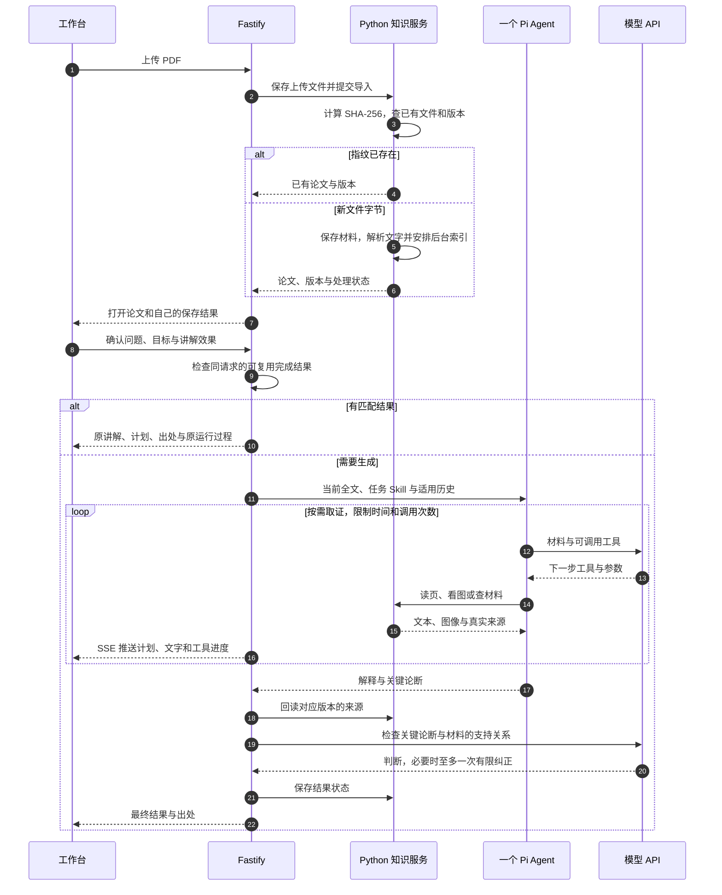
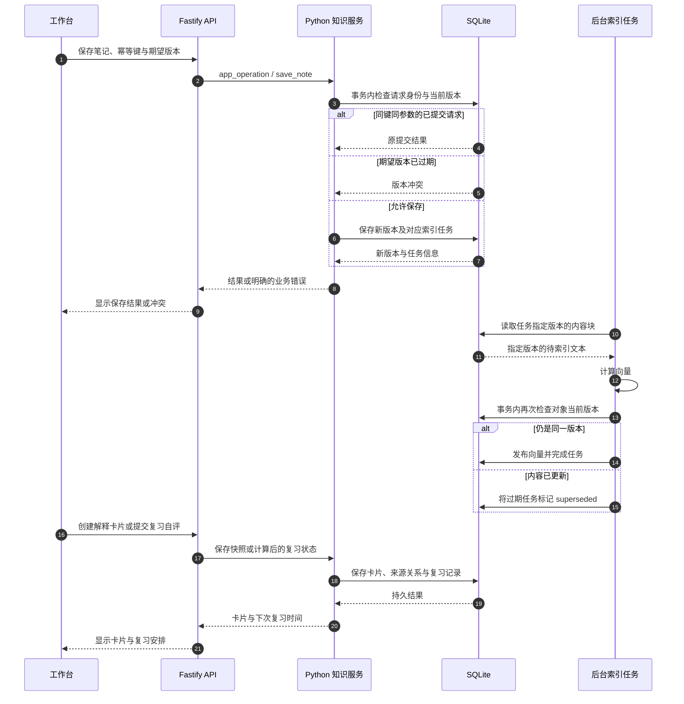

# ScholarPi


**读懂论文，留下理解。** ScholarPi 是一个论文阅读与个人知识工作台：上传 PDF，自由选择问题和讲解效果，阅读带原文出处的解释，再把确认过的理解保存成笔记和卡片。



[使用指南](docs/project-guide.md)

## 从什么问题出发

读论文时，摘要不一定能讲清方法；讲解没有原页位置，就难以核对；笔记散落各处，又难以找回以前的理解。ScholarPi 将这些操作放在同一个工作台：**阅读 → 核对 → 记录 → 找回 → 复习**。

- **自己决定怎么读：** 选择整体理解、方法机制、图表与公式，或直接输入问题；再选择建立直觉、掌握方法、深入技术。上传文件不会自动替用户发问。
- **解释可以回到原文：** 读取论文全文，按需读取原页图像；点击出处打开对应版本、物理页和位置。
- **同一文件继续读：** 对实际文件字节计算 SHA-256，重复上传打开已有论文；满足条件的相同阅读请求可以复用已完成结果。
- **保存当时的理解：** 笔记保留版本，解释卡片保留自己的正反面快照；来源删除只改变可用提示，不覆盖解释和复习记录。
- **找回过去的材料：** 将关键词检索与语义检索合并，必要时沿有出处的关联寻找论文、笔记和卡片。

Pi 提供 Agent 循环、工具基础设施与会话管理；本项目实现论文业务工具、来源和版本约定，以及网页交互。数据主要存储在本机；阅读、图像理解与关键论断复核调用配置的模型 API。实现采用 AI 辅助开发。

## 启动

需要 Node.js **24+**、npm、uv。安装脚本使用独立的 Python 3.12 环境。

```powershell
npm run setup
if (-not (Test-Path -LiteralPath .env)) { Copy-Item .env.example .env }
# 在 .env 填入自己的 AGNES_API_KEY
npm run dev
```

默认前端地址 `http://127.0.0.1:5173`，HTTP API 端口 `7331`，MCP 服务端口 `7332`。端口与模型配置通过 `.env` 修改，具体地址以启动器输出为准。`Ctrl+C` 结束本次启动的服务。

首次构建向量索引会下载 Qwen3-Embedding-0.6B；结构解析也需要下载 Docling 所需模型。全文和关键词索引先提供，结构和向量任务在后台完成。向量未就绪时使用关键词检索。

## 第一次使用

1. 在首页点击 **上传论文 PDF**，或打开自己的已导入论文。
2. 在论文工作台选择阅读目标和讲解效果，确认问题后点击 **发送**；也可以自由追问。
3. 点击回答中的页码核对 PDF。**展开原文／收起原文**只改变原文面板的显示。
4. 调整阅读路线，或者将确认后的解释 **记到笔记／加入卡片**。
5. 在 **查找知识** 找回记录，在 **解释卡片** 翻面并自评；点击 **首页** 或左上角 ScholarPi 返回入口。

可用一份公开论文尝试“用简单的话讲方法”和“结合图表讲技术细节”，观察目标、效果及工具读取如何变化。同一个文件改名后再次上传，仍能打开原来的论文。自己的已保存讲解可直接打开，其中的“运行过程”展示原生成事件；打开结果不会伪装成重新生成。

## 系统如何分工

主线是 **单 Agent＋可调整阅读计划＋按任务加载 Skills**。Agent 决定下一步取什么材料；计划让用户看到阅读路线；Skills 提供这类任务的操作说明；工具执行真正的文件和数据操作。





## 项目目录

```text
apps/web/                     React 页面、PDF、笔记与卡片
apps/server/                  HTTP/SSE、Pi 会话、工具编排与来源复核
packages/contracts/           共享数据结构与阅读选项
services/knowledge/           Python MCP、PDF、SQLite 与检索
skills/                       四类阅读任务说明
scripts/setup.mjs              安装依赖
scripts/dev.mjs                启动本地服务
docs/project-guide.md          用户操作指南
```

依赖实际版本以 `package-lock.json` 和 `services/knowledge/uv.lock` 为准。

## 配置与检查

首次从 GitHub 获取项目：

```powershell
git clone https://github.com/csb-ai/ScholarPi.git
Set-Location ScholarPi
npm run setup
if (-not (Test-Path -LiteralPath .env)) { Copy-Item .env.example .env }
# 用文本编辑器填写 .env 中自己的 AGNES_API_KEY，再运行：
npm run dev
```

安装步骤在本目录执行。`setup` 先按 npm 锁文件安装前后端依赖，再通过 uv 创建 Python 3.12 独立环境；不需要 MySQL、Redis、GPU 或 Docker。首次安装和模型下载需要网络。前端使用 Vite 开发服务，API 与知识服务仅监听本机回环地址。

| 配置项 | 默认值与用途 |
|---|---|
| `AGNES_API_KEY` | 必填的个人模型密钥；只保存到 `.env`，不提交 |
| `AGNES_BASE_URL` / `AGNES_MODEL` | 模型服务地址 / `agnes-3.0-flash`；更换供应商需自行验证文字、图像和工具协议 |
| `WEB_PORT` | `5173`，网页入口 |
| `SERVER_PORT` | `7331`，HTTP/SSE；Vite 代理随启动器环境指向此端口 |
| `MCP_URL` | `http://127.0.0.1:7332/mcp`；本地知识服务路径和端口 |
| `RUN_TIMEOUT_MS` | `180000`，阅读运行截止时间（毫秒） |
| `MAX_TOOL_CALLS` | `8`，Agent 业务工具尝试上限；不是所有模型调用的总次数 |

源码锁定 Qwen3-Embedding 模型及 revision；`.env.example` 的 `EMBEDDING_MODEL` 仅作模型说明，当前实现不通过该项动态更换模型。修改嵌入模型还需同步模型版本、向量维度与索引重建逻辑。

公开源码可执行下列检查；完整测试与本地评测材料不随此发行目录发布：

```powershell
npm run typecheck
npm run build
Invoke-RestMethod http://127.0.0.1:7331/api/health
```

`build` 生成网页静态资源，不会将 SQLite/MCP/模型服务变成静态页面；使用仍需 `npm run dev` 启动三个服务。健康接口的 `configured` 只表示存在密钥配置，不能证明密钥有效或供应商可达。

## 工具与源码导航

阅读 Agent 只使用下列 8 个业务工具。Python MCP 另有 `app_operation` 供 HTTP 后端管理业务，不向阅读 Agent 暴露。

| 工具 | 用户可观察的作用 |
|---|---|
| `get_paper_overview` | 查看论文元数据、页面覆盖和结构树 |
| `read_paper_text` | 读取指定版本全文或明确页码范围 |
| `read_page_image` | 获取原页图像，必要时读取归一化坐标范围 |
| `search_knowledge` | 联合查找论文、笔记与解释卡片 |
| `get_source` | 回读精确来源、版本与可用状态 |
| `query_source_graph` | 沿已有来源关系作有界扩展 |
| `save_note` | 在用户要求保存时写入笔记，并校验版本与幂等键 |
| `create_card` | 保存解释卡片快照及创建依据 |

普通 Function Calling 直接提交工具名与参数；JSON Code Mode 用 `{code: string}` 承载 JavaScript，在 Pi 受限 VM 中组织同一组白名单工具。独立只读操作可以并行并分别记录失败；写入操作顺序执行。阅读计划、加载 Skill 和提交结果属于另外的控制工具，不计作这 8 个业务工具。

| 入口 | 负责内容 |
|---|---|
| `apps/server/src/index.ts` | 上传入口、HTTP/SSE、笔记与卡片 API |
| `apps/server/src/runtime.ts` | Pi 会话、显式计划、Skills、两种工具编排及来源/论断复核 |
| `apps/server/src/reading-cache.ts` | 独立阅读任务范围、结果键与已完成结果选择 |
| `apps/server/src/control.ts` / `tool-protocol.ts` | 阅读计划状态、预算及工具消息协议整理 |
| `packages/contracts/reading-options.ts` | 网页和后端共享的阅读目标、效果选项 |
| `services/knowledge/scholarpi_knowledge/__main__.py` | MCP 服务启动、8 个业务工具及内部管理桥接 |
| `services/knowledge/scholarpi_knowledge/documents.py` | PDF 字节指纹、版本、页面与原文来源 |
| `services/knowledge/scholarpi_knowledge/retrieval.py` | FTS5、Qwen3、RRF 和有界来源关系扩展 |
| `services/knowledge/scholarpi_knowledge/store.py` / `service.py` | SQLite 事务、幂等、历史版本、后台索引发布 |
| `apps/server/src/review.ts` | FSRS 复习调度与参数校验 |

## 已完成讲解如何复用

文件去重与答案复用是两个独立判断。上传按文件实际字节的 SHA-256 查找已有论文，不因改文件名重新解析；讲解复用还要匹配论文对象/版本、规范化问题、阅读目标、效果、编排模式和引擎指纹。

仅独立只读的整体理解、方法机制和图表任务可进入复用路径。包含历史上下文、笔记、卡片、保存等内容的问题不使用这类跨会话结果；“重新生成”可跳过复用。可复用结果必须已完成、正文非空、带阅读计划且无运行错误。这个条件不是“所有论断正确”的质量保证。复用界面保留原始生成时间、出处和事件，不将历史输出显示为本轮新生成。

## 笔记保存与索引发布的请求顺序

下面是第三张完整链路图，连接网页编辑、业务写入、后台索引以及卡片复习。写入统一经过 Python 知识服务；幂等检查与版本检查保护不同的失败场景。



响应丢失后，同一幂等键与参数可返回原结果；编辑冲突需要基于新版本处理。索引完成时仍会核对版本，避免旧任务覆盖新内容。解释卡片保留创建时的快照，来源删除只改变可用提示，不重写已经保存的解释与复习历史。SQLite WAL 不代表任意多个业务写入者可以绕过这些约束。

## 常见问题与当前限制

- **端口已占用：** 启动器会直接停止并指出端口，避免连接到未知服务。如果原 ScholarPi 正在运行，打开其地址继续；否则结束自己的旧启动器，或在 `.env` 调整三个端口后重启，不必结束其他应用。
- **启动后显示未配置、401 或 403：** 检查 `.env` 的变量名、模型名称和供应商权限，然后重启服务；不要将完整密钥或请求头贴进日志/Issue。模型调用失败不会静默切换其他供应商。
- **MCP health timeout / Python 模块缺失：** 在仓库根目录重新执行 `npm run setup`，确认 uv 能使用 Python 3.12；检查 7332 的占用和启动终端输出。不要只安装前端 npm 包而跳过知识服务。
- **下载模型慢或向量尚未就绪：** 首次下载需要网络和磁盘空间；界面可先使用已发布文本及关键词检索。模型已加载不代表每个当前版本块都完成向量索引，检查页面处理状态后再判断检索覆盖。
- **PDF 不能处理或过长：** 单个上传上限为 100 MiB；扫描页需要模型转写并保留覆盖状态。过大全文会显式提示分批阅读，当前不自动分卷；加密、损坏、复杂版面的 PDF 可能需要预处理。
- **有引用仍可能解释错误：** 来源可定位与语义支持分别检查，最多一次有限纠正。模型复核可能误判，也不覆盖所有未提交的正文论断；关键结论请打开原文核对。
- **为什么未复用旧回答：** 问题、效果、模式、文件版本或引擎实现不同会改变结果键；失败/取消/缺少计划的结果不复用。涉及历史与写入的任务使用当前上下文。
- **数据保存在哪里：** 本机运行会创建 `data/`（上传、业务存储与会话）和 `artifacts/`（运行记录）。这些目录已忽略且不会随源码发布；重新克隆是空知识库，不携带他人的 PDF、笔记和回答。迁移时先停止服务，再备份整个本地数据与会话目录。

这是面向个人本地使用的应用，未提供多用户鉴权、互联网部署入口或生产级任意代码隔离。远程模型会接收完成任务所需的文本、原页图像和相关记录；本地存储不表示完全离线。程序未证明学习效果或相对其他架构的性能提升。

## 许可证与依赖归属

应用源码按仓库 `LICENSE` 中的 GNU AGPL v3 发布。依赖与模型分别遵循各自许可证，安装后的依赖包保留原许可证；PyMuPDF 使用 AGPL v3 或 Artifex 商业许可，商业集成应按实际使用方式核对相应许可。

Pi 提供 Agent 循环、会话与受限代码执行；PyMuPDF/Docling 提供文档处理；Qwen3-Embedding 提供文本向量；ts-fsrs 提供复习调度。它们不是 ScholarPi 自研算法。宣传插画由 AI 生成，项目徽章仅标注使用技术，不表示官方认证。源码不包含第三方论文 PDF 或私人演示资料。
