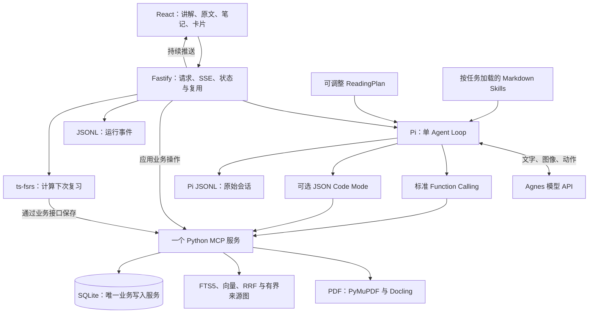
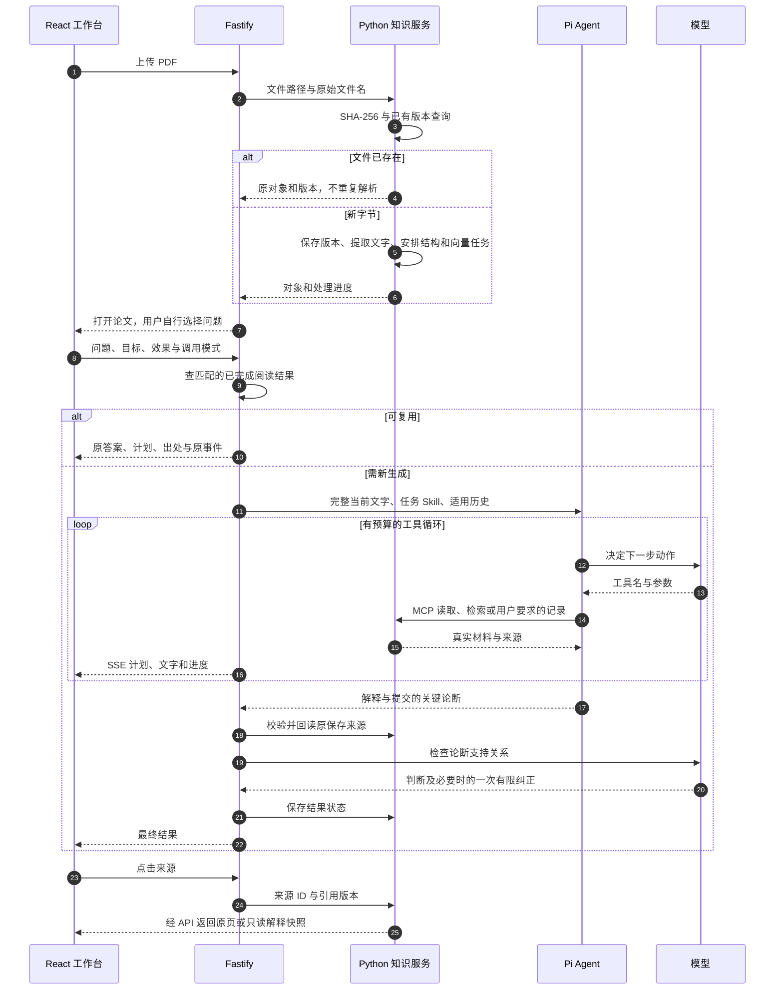
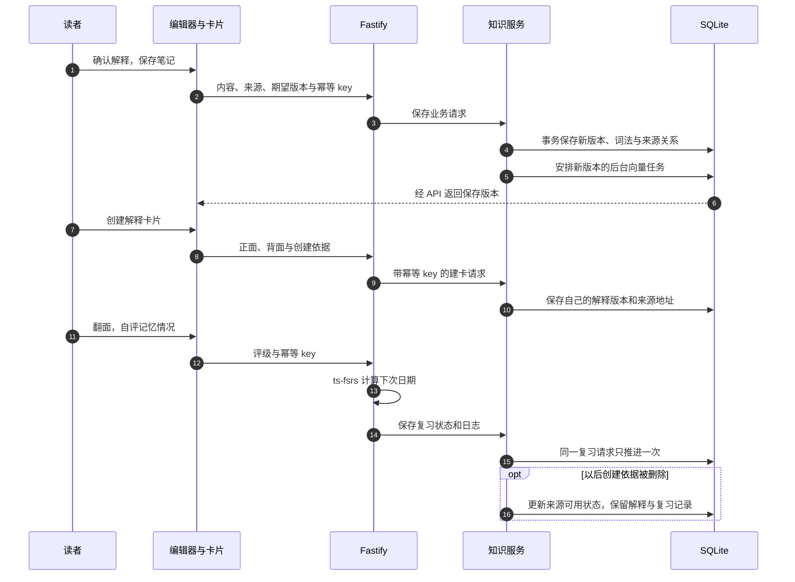

# ScholarPi 使用指南

上传 PDF，自由选择阅读问题和讲解效果，在同一个工作台核对原文、保存解释与复习。

## 1. 第一次使用

### 安装与启动

需要 Node.js 24+、npm、uv。项目安装到独立的 Python 3.12 环境。

```powershell
npm run setup
if (-not (Test-Path -LiteralPath .env)) { Copy-Item .env.example .env }
# 在 .env 配置 AGNES_API_KEY
npm run dev
```

前端默认 `http://127.0.0.1:5173`，API 默认 7331，知识服务默认 7332。配置可在 `.env` 修改，打开启动器实际输出的地址。模型调用使用 API；业务文件、笔记和卡片主要保存在本机。

首次索引需下载嵌入模型和结构解析所需模型。程序先发布可读文字与关键词索引，再后台处理结构和向量；界面展示真实进度，不把“已上传”等同于“所有索引已完成”。

### 页面怎么点，怎么返回

1. **首页／左上角 ScholarPi：** 返回入口，查看自己的论文。
2. **上传论文 PDF：** 真正上传文件。相同字节打开原论文；不同字节进入材料处理，同名变更建立新版本。
3. **论文讲解：** 选择阅读目标和效果，或者自己输入问题。上传后不会自动发送。
4. **已保存的讲解：** 查看自己已经完成的结果；原生成时间与运行过程保留。
5. **展开原文／收起原文：** 切换 PDF 面板，仍留在同一篇论文里。点击出处会打开对应材料。
6. **我的笔记：** 编辑当前笔记，保存时检查版本。引用旧笔记会另外打开只读快照。
7. **解释卡片：** 看正面、翻面、自评，程序安排下一次复习。
8. **来源关系／查找知识：** 查看已有联系，或者按词和意思检索材料。

“新对话”建立新的讨论，不删除旧记录；“停止本轮”取消当前生成，保留已收到的材料。窄窗口进入论文时先收起原文，方便使用讲解区，再按需展开。

### 选择目标与效果

阅读目标决定要解决哪种问题，讲解效果决定解释的深度和表达。二者可以自由组合。

| 目标 | 适合的问题 |
|---|---|
| 整体理解 | 论文研究什么、旧方法有什么限制、主要贡献和边界是什么？ |
| 方法机制 | 输入是什么、每步怎样工作、输出是什么、为什么这样设计？ |
| 图表与公式 | 图中箭头、变量和条件是什么，正文和图是否对应？ |
| 自由问题 | 当前困惑，或需要找回其他论文和自己的记录。 |

| 效果 | 你会看到什么 |
|---|---|
| 建立直觉 | 少用术语，多解释背景、类比和核心想法。 |
| 掌握方法 | 展开输入、步骤、输出、前提与适用边界。 |
| 深入技术 | 结合图、公式和实验条件，核对更具体的技术细节。 |

这些选择改变本轮任务说明，不是训练了不同模型，也不自动代表不同思考等级。目标按钮填写的示例问题可以编辑；图号和物理页码以当前论文为准，不假设所有论文的 Figure 1 都在第 2 页。

### 一个普通使用例子

准备一份可合法使用的公开论文 PDF。先问“用简单的话讲清这篇论文为什么这样设计”，再问“结合第 2 页的图解释各步骤”，选择适合的效果。点击回答的出处，核对原图和正文；将你认可的解释存成笔记，选一个术语创建卡片。

把同一文件改名后重新上传，程序会按字节指纹打开原对象和版本。再次提交完全匹配的独立阅读请求时，可以返回原完成结果；换效果、换问题或选择“重新生成”会实际生成。新安装不会自带别人已经生成的回答，需导入自己的材料并使用自己的模型配置。

## 2. 系统结构与运行流程



网页不直接操作数据库，模型不直接读宿主文件。HTTP 后端管理会话和页面请求；Python 服务处理论文、检索及业务写入；Pi 把模型和这些能力连成一次阅读。

### 上传、提问与引用的顺序



### 从记录到复习


